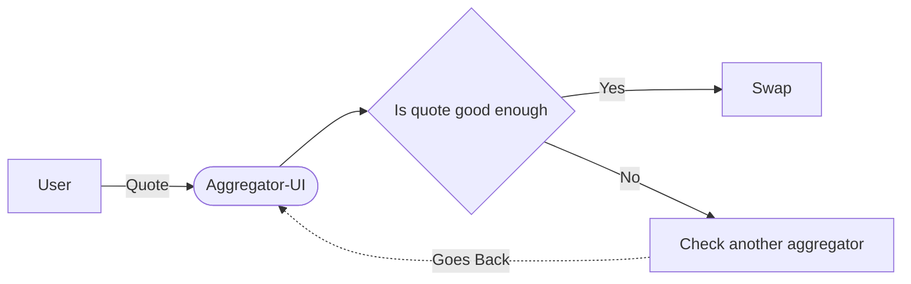

# Aggregator Of Aggregators - intro
By calling other aggregator's api just as a normal user does in a browser, we can find the best quote between different aggregators.
This helps users to chose the best possible result at any given time.

It's just like as if user, enter the desired tokens to the aggregator and then after confirm the price; swapped on the recommended aggregator.

### Normal Flow
Let's say user want to test out if is it good enough to use 1inch aggregator or not.
And if not, check the quotes on another aggregator . 

