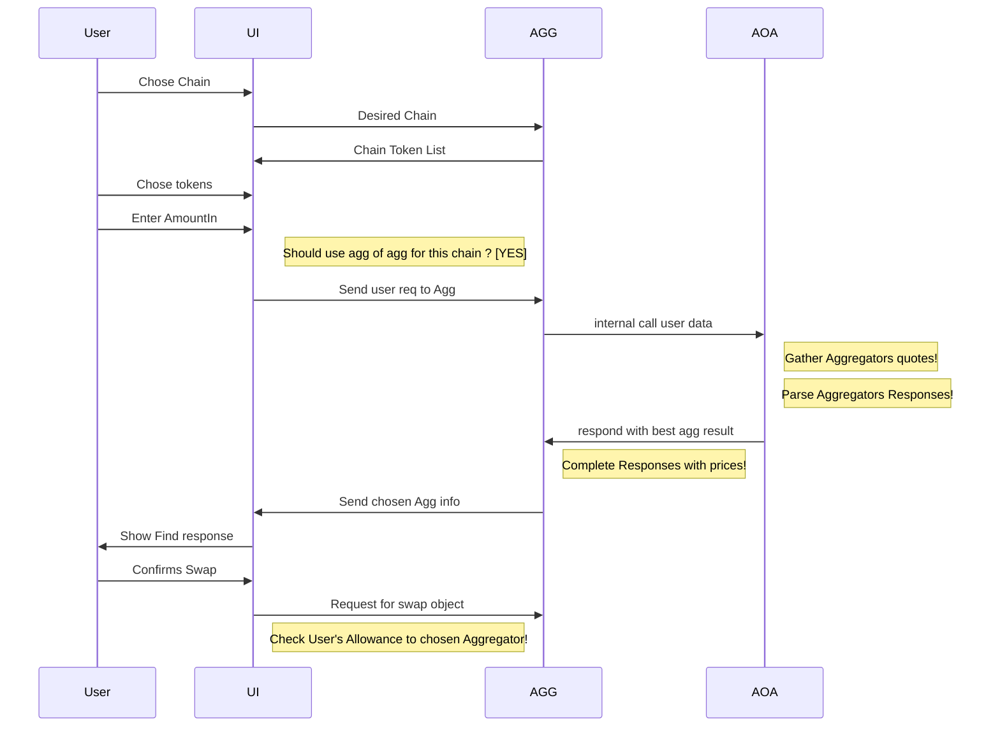

# AOA - Data Flow
Goal is to guide user to swap on the best possible quote.

```mermaid
sequenceDiagram
    User->>UI: Chose Chain 
    UI->>AGG: Desired Chain
    AGG->>UI: Chain Token List
    User->>UI: Chose tokens  
    User->>UI: Enter AmountIn 
    note left of AGG: Should use agg of agg for this chain ? [YES]
    UI->>AGG: Send user req to Agg  
    AGG->>AOA: internal call user data 
    note right of AOA: Gather Aggregators quotes! 
    note right of AOA: Parse Aggregators Responses! 
    AOA->>AGG: respond with best agg result
    note right of AGG: Complete Responses with prices! 
    AGG->>UI:Send chosen Agg info
    UI->>User:Show Find response
    User->>UI:Confirms Swap 
    UI->>AGG:Request for swap object 
    note left of AGG: Check User's Allowance to chosen Aggregator!


```