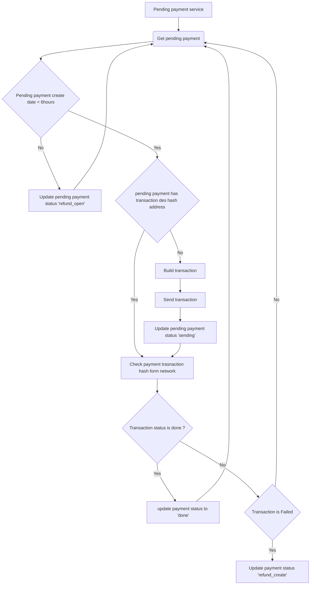

# Pending payment Service

## About
This service is get pending payments from the database and start checking payment status


--------------------------------------
## Flowchart diagram



## Code logic
> CheckPendingPayment class inherit from BaseContract

### check method
Get all pending payments
if pending more than 8 hours update pending payment to refund status and 
waiting for refund service

and if it is pending mare than 300 seconds and the telegram bot is activ start sending message in telegram log channel

```python
def check(self):
    calculating_fee_initialize()
    pending_payment_list = self.payment_db.objects.filter(
        status=PAYMENT_TYPE_PENDING
    )
    
    pending_pends_list: list = []

    for pending_payment in pending_payment_list:
        if pending_payment.created_time <= (
                datetime.datetime.now(datetime.timezone.utc) - datetime.timedelta(seconds=300)
        ):
            pending_pends_list.append(pending_payment.payment_key.__str__())

        if pending_payment.created_time <= (
                datetime.datetime.now(
                    datetime.timezone.utc) - datetime.timedelta(hours=8)
        ):
            self.refund_payment(pending_payment)
        else:
            self.start_pay(pending_payment)

    if len(pending_pends_list) > 0:
        self.send_pending_telegram_message(pending_pends_list)
```

### start_pay method
if created destination transaction and stored transaction hash first checking transaction 
hash and if the transaction is done in network update payment status to done and if failed in-network 
update payment status to failed and if the destination transaction is none try to create a destination transaction.

```python
def start_pay(self, pending_payment):
    contract_des = self.set_contract(
        payment_transaction=pending_payment.transaction_des
    )
    if contract_des is None:
        BaseLogger.log_error(
            f"payment_key:{pending_payment.payment_key} ,"
            f"can not set contract pending payment"
        )
        return
    BaseLogger.log_info(f"set contract success fully {pending_payment.payment_key}")
    if pending_payment.transaction_des.transaction_hash is None:
        transaction_des = self.create_transaction_des(
            contract_des=contract_des,
            transaction_data=pending_payment.transaction_des
        )

        if transaction_des is not None:
            self.sending_payment(pending_payment)
        else:
            BaseLogger.log_error(
                f"payment_key:{pending_payment.payment_key} ,"
                f"can not set build transaction"
            )
            return

    transaction_result = contract_des.get_transaction(
        pending_payment.transaction_des.transaction_hash
    )
    gas_price = contract_des.get_gas_price(pending_payment.transaction_des.transaction_hash)
    if transaction_result is not None:
        status = transaction_result.get("status")
        if status == 1:  # success transaction status
            self.done_payment(
                payment=pending_payment,
                transaction_result=transaction_result,
                gas_price=gas_price
            )

        if status == 0:  # fail transaction status
            self.refund_payment(pending_payment)
```