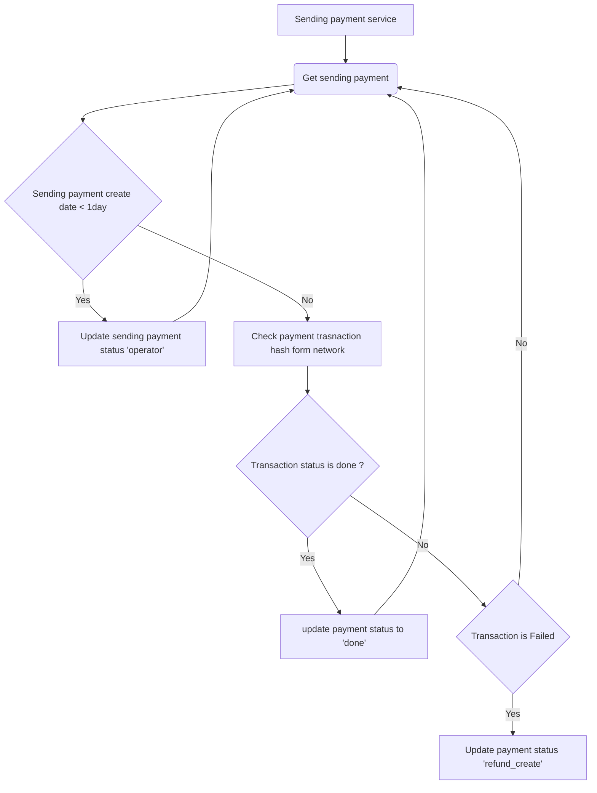

# Sending payment service
## About
This service get sending payments status and trying get transaction status form network and update 
payment status
## Flowchart diagram


## Code logic
> CheckSendingPayment class inherit from BaseContract

### check method
If sending payment to stay sending status more than one 1-day update status to **operator** status for
operators are checking payment transaction status in the network or other issues
else start to check destination transaction hash from the network and update payment status
or waiting for a network valid response.

If the destination transaction in the network is successful update payment to done status and get real estimated gas
from transaction info and if destination transaction is failed 
update transaction status to refund for paying back the user payments price in the source transaction
```python
def check(self):
    calculating_fee_initialize()
    sending_pends_list: list = []
    sending_payment_list = self.payment_db.objects.filter(
        status=PAYMENT_TYPE_SENDING
    )
    BaseLogger.log_info(
        f"len sending payment {len(sending_payment_list)}",
    )
    for sending_payment in sending_payment_list:
        if sending_payment.created_time <= (
                datetime.datetime.now(datetime.timezone.utc) - datetime.timedelta(seconds=300)
        ):
            sending_pends_list.append(sending_payment.payment_key.__str__())
        if sending_payment.created_time <= (
                datetime.datetime.now(
                    datetime.timezone.utc) - datetime.timedelta(days=1)
        ):
            self.operation_payment(sending_payment)
        else:
            contract = self.set_contract(
                payment_transaction=sending_payment.transaction_des
            )
            transaction_result = contract.get_transaction(
                sending_payment.transaction_des.transaction_hash
            )
            gas_price = contract.get_gas_price(
                sending_payment.transaction_des.transaction_hash
            )

            if transaction_result is not None:
                status = transaction_result.get("status")
                if status == 1:  # success transaction status
                    self.done_payment(
                        payment=sending_payment,
                        transaction_result=transaction_result,
                        gas_price=gas_price
                    )

                if status == 0:  # fail transaction status
                    self.refund_payment(payment=sending_payment)

    if len(sending_pends_list) > 0:
        self.send_sending_telegram_message(sending_pends_list)
```